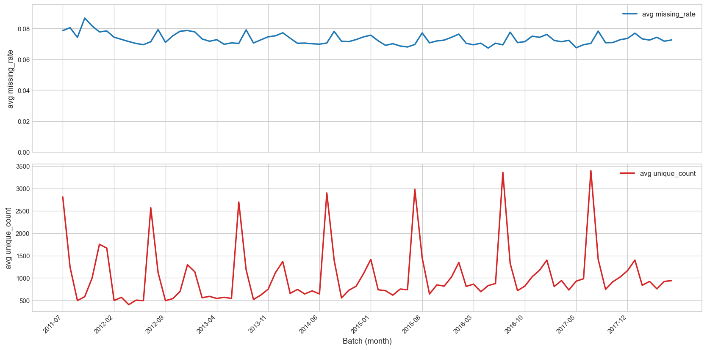
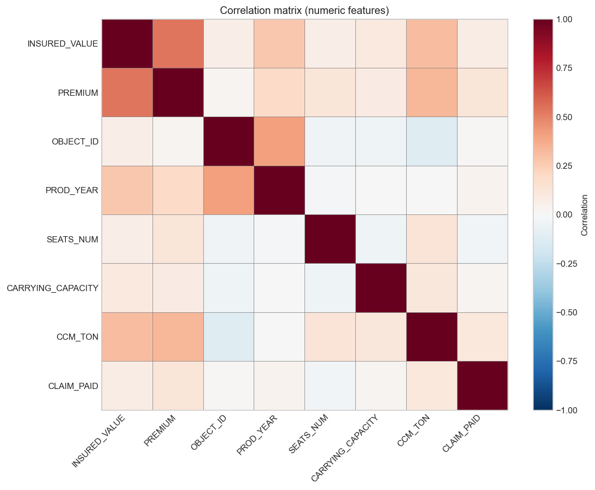
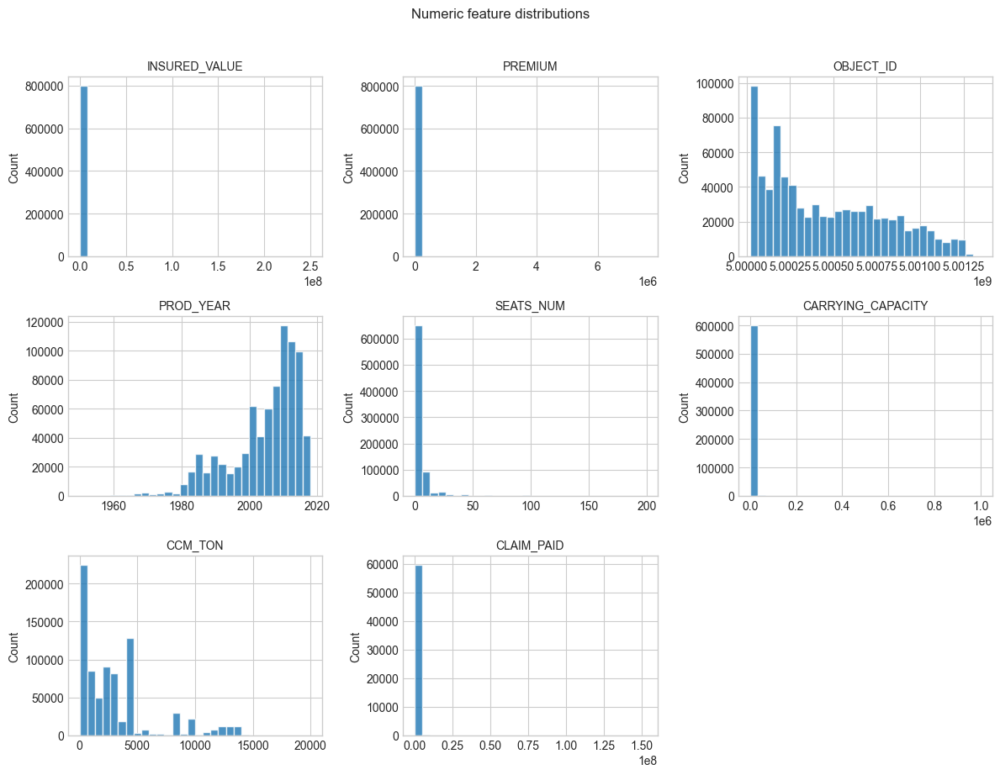

# Data Quality Report

## Summary

- **Batches:** 84
- **Features:** 16
- **Records:** 1344

---

## 1. By batch (aggregates)

## 2. By feature (aggregates)

| feature | value_type | n_batches | avg missing_rate | min | max | avg unique_count | min | max |
|---------|------------|-----------|------------------|-----|-----|------------------|-----|-----|
| CARRYING_CAPACITY | numeric | 84 | 0.2408 | 0.1500 | 0.4493 | 422.3 | 280 | 881 |
| CCM_TON | numeric | 84 | 0.0000 | 0.0000 | 0.0002 | 580.5 | 312 | 1055 |
| CLAIM_PAID | numeric | 84 | 0.9288 | 0.8860 | 0.9737 | 658.5 | 179 | 2928 |
| EFFECTIVE_YR | categorical | 84 | 0.0000 | 0.0000 | 0.0001 | 93.3 | 65 | 115 |
| INSR_BEGIN | categorical | 84 | 0.0000 | 0.0000 | 0.0000 | 30.4 | 28 | 31 |
| INSR_END | categorical | 84 | 0.0000 | 0.0000 | 0.0000 | 84.8 | 53 | 274 |
| INSR_TYPE | categorical | 84 | 0.0000 | 0.0000 | 0.0000 | 2.8 | 2 | 3 |
| INSURED_VALUE | numeric | 84 | 0.0000 | 0.0000 | 0.0000 | 978.9 | 497 | 4200 |
| MAKE | categorical | 84 | 0.0000 | 0.0000 | 0.0001 | 169.9 | 96 | 384 |
| OBJECT_ID | numeric | 84 | 0.0000 | 0.0000 | 0.0000 | 9466.2 | 2679 | 33445 |
| PREMIUM | numeric | 84 | 0.0000 | 0.0000 | 0.0003 | 4242.3 | 1902 | 12826 |
| PROD_YEAR | numeric | 84 | 0.0002 | 0.0000 | 0.0025 | 58.2 | 51 | 67 |
| SEATS_NUM | numeric | 84 | 0.0003 | 0.0000 | 0.0026 | 49.5 | 39 | 69 |
| SEX | categorical | 84 | 0.0000 | 0.0000 | 0.0000 | 3.0 | 3 | 3 |
| TYPE_VEHICLE | categorical | 84 | 0.0000 | 0.0000 | 0.0000 | 10.2 | 10 | 11 |
| USAGE | categorical | 84 | 0.0000 | 0.0000 | 0.0000 | 13.4 | 13 | 14 |

---

# Automatic EDA

## Summary

- **Rows:** 802,036
- **Columns:** 16

## 1. Overview by column

| Column | Type | Missing % | Unique count |
|--------|------|-----------|---------------|
| SEX | categorical | 0.00% | 3 |
| INSR_BEGIN | categorical | 0.00% | 2556 |
| INSR_END | categorical | 0.00% | 2834 |
| EFFECTIVE_YR | categorical | 0.00% | 151 |
| INSR_TYPE | categorical | 0.00% | 3 |
| INSURED_VALUE | numeric | 0.00% | 17437 |
| PREMIUM | numeric | 0.00% | 276433 |
| OBJECT_ID | numeric | 0.00% | 288763 |
| PROD_YEAR | numeric | 0.02% | 69 |
| SEATS_NUM | numeric | 0.03% | 96 |
| CARRYING_CAPACITY | numeric | 24.71% | 2766 |
| TYPE_VEHICLE | categorical | 0.00% | 11 |
| CCM_TON | numeric | 0.00% | 3776 |
| MAKE | categorical | 0.00% | 797 |
| USAGE | categorical | 0.00% | 14 |
| CLAIM_PAID | numeric | 92.50% | 45770 |

## 2. Numeric features

| index | INSURED_VALUE | PREMIUM | OBJECT_ID | PROD_YEAR | SEATS_NUM | CARRYING_CAPACITY | CCM_TON | CLAIM_PAID |
|---|---|---|---|---|---|---|---|---|
| count | 802036.0 | 802015.0 | 802036.0 | 801867.0 | 801801.0 | 603837.0 | 802028.0 | 60145.0 |
| mean | 509129.4271 | 7406.9871 | 5000453189.8073 | 2004.534 | 6.1304 | 497.8776 | 3172.6981 | 256480.175 |
| std | 901783.2983 | 13524.5586 | 344416.5032 | 10.228 | 13.4035 | 3861.2185 | 3445.4551 | 1495336.3536 |
| min | 0.0 | 0.0 | 5000017899.0 | 1950.0 | 0.0 | 0.0 | 0.0 | 0.0 |
| 25% | 0.0 | 755.7 | 5000160378.0 | 2000.0 | 1.0 | 0.0 | 200.0 | 13500.0 |
| 50% | 180000.0 | 3376.55 | 5000380148.0 | 2008.0 | 4.0 | 6.0 | 2494.0 | 34633.52 |
| 75% | 730000.0 | 9643.27 | 5000717592.0 | 2012.0 | 4.0 | 35.0 | 4164.0 | 133869.0 |
| max | 250000000.0 | 7581230.43 | 5001350531.0 | 2018.0 | 199.0 | 1000000.0 | 20000.0 | 152445764.9 |

### Correlation matrix

### Distributions

## 3. Categorical features (top 10 values)

### SEX

| value | count |
|-------|-------|
| 0 | 415297 |
| 1 | 318650 |
| 2 | 68089 |

### INSR_BEGIN

| value | count |
|-------|-------|
| 2017-07-08 00:00:00 | 16754 |
| 2016-07-08 00:00:00 | 15640 |
| 2011-07-08 00:00:00 | 15215 |
| 2015-07-08 00:00:00 | 13464 |
| 2014-07-08 00:00:00 | 13121 |
| 2013-07-08 00:00:00 | 12160 |
| 2012-07-08 00:00:00 | 12157 |
| 2016-07-01 00:00:00 | 8076 |
| 2017-07-01 00:00:00 | 7537 |
| 2015-07-01 00:00:00 | 5567 |

### INSR_END

| value | count |
|-------|-------|
| 07-JUL-18 | 17378 |
| 07-JUL-17 | 15827 |
| 07-JUL-16 | 14864 |
| 07-JUL-13 | 13594 |
| 07-JUL-15 | 13248 |
| 07-JUL-14 | 12319 |
| 07-JUL-12 | 11786 |
| 30-JUN-17 | 8229 |
| 30-JUN-18 | 7570 |
| 30-JUN-16 | 5677 |

### EFFECTIVE_YR

| value | count |
|-------|-------|
| 11 | 199888 |
| 12 | 86791 |
| 15 | 75484 |
| 14 | 74001 |
| 16 | 68866 |
| 13 | 65577 |
| 17 | 57060 |
| 18 | 21547 |
| 95 | 11400 |
| 01 | 10992 |

### INSR_TYPE

| value | count |
|-------|-------|
| 1202 | 594204 |
| 1201 | 207497 |
| 1204 | 335 |

### TYPE_VEHICLE

| value | count |
|-------|-------|
| Truck | 151088 |
| Pick-up | 144874 |
| Motor-cycle | 143186 |
| Automobile | 125993 |
| Bus | 106015 |
| Station Wagones | 60785 |
| Trailers and semitrailers | 35954 |
| Special construction | 12077 |
| Tractor | 11414 |
| Tanker | 10632 |

### MAKE

| value | count |
|-------|-------|
| TOYOTA | 272682 |
| ISUZU | 75694 |
| BAJAJI | 67344 |
| NISSAN | 37186 |
| MITSUBISHI | 22093 |
| IVECO | 20441 |
| BAJAJ | 17925 |
| SINO HOWO | 17026 |
| YAMAHA | 15743 |
| SUZUKI | 13063 |

### USAGE

| value | count |
|-------|-------|
| Own Goods | 219571 |
| Private | 205102 |
| General Cartage | 125502 |
| Fare Paying Passengers | 118236 |
| Own service | 50521 |
| Taxi | 46762 |
| Others | 8962 |
| Agricultural Own Farm | 7912 |
| Special Construction | 6925 |
| Agricultural Any Farm | 3773 |
