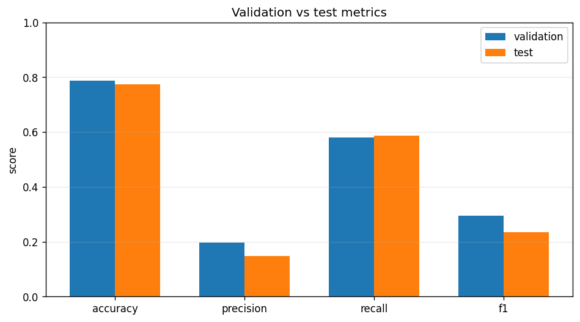

# Model Validation Report: catboost

## Summary

- **Validation run id:** 1
- **Model family:** catboost
- **Selected:** yes
- **Created at:** 2026-03-22 20:28:20
- **Artifact path:** `artifacts/models/catboost/20260322_232820.joblib`

## Metrics

| Split | Accuracy | Precision | Recall | F1 | N samples | Latency ms |
|-------|----------|-----------|--------|----|-----------|------------|
| validation | 0.7868 | 0.1977 | 0.5791 | 0.2948 | 140518 | 97.5092 |
| test | 0.7745 | 0.1469 | 0.5860 | 0.2349 | 147238 | 362.3974 |

## Chart



## Class Balance

| Split | True positives | Pred positives | Positive rate | Pred positive rate | Zero baseline accuracy |
|-------|----------------|----------------|---------------|--------------------|------------------------|
| validation | 10811 | 31665 | 0.0769 | 0.2253 | 0.9231 |
| test | 8699 | 34702 | 0.0591 | 0.2357 | 0.9409 |

## Confusion Matrix

| Split | TP | TN | FP | FN |
|-------|----|----|----|----|
| validation | 6261 | 104303 | 25404 | 4550 |
| test | 5098 | 108935 | 29604 | 3601 |

## Split

- **Train ratio:** 0.7
- **Validation ratio:** 0.15
- **Test ratio:** 0.15
- **Train dates:** 1789
- **Validation dates:** 383
- **Test dates:** 384
- **Train rows:** 514280

## Feature Space

- **Feature columns:** 8
- **Numeric features:** 1
- **Categorical features:** 7
- **Dropped columns:** CARRYING_CAPACITY, CCM_TON, INSURED_VALUE, OBJECT_ID, PROD_YEAR, SEATS_NUM

## Hyperparameters

```json
{
  "allow_writing_files": false,
  "depth": 6,
  "iterations": 300,
  "learning_rate": 0.1,
  "loss_function": "Logloss",
  "verbose": false
}
```
