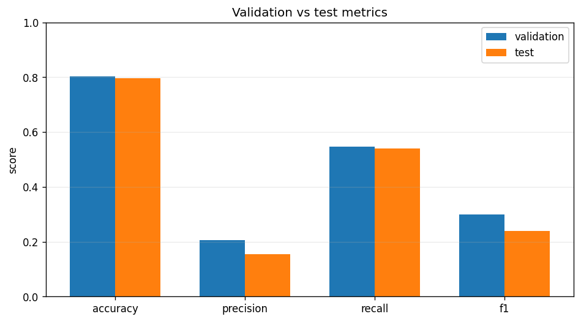

# Model Validation Report: catboost

## Summary

- **Validation run id:** 3
- **Model family:** catboost
- **Selected:** yes
- **Created at:** 2026-03-22 20:44:11
- **Artifact path:** `artifacts/models/catboost/20260322_234411.joblib`

## Metrics

| Split | Accuracy | Precision | Recall | F1 | N samples | Latency ms |
|-------|----------|-----------|--------|----|-----------|------------|
| validation | 0.8023 | 0.2052 | 0.5465 | 0.2984 | 140518 | 104.4326 |
| test | 0.7972 | 0.1538 | 0.5402 | 0.2394 | 147238 | 442.6064 |

## Chart



## Class Balance

| Split | True positives | Pred positives | Positive rate | Pred positive rate | Zero baseline accuracy |
|-------|----------------|----------------|---------------|--------------------|------------------------|
| validation | 10811 | 28788 | 0.0769 | 0.2049 | 0.9231 |
| test | 8699 | 30554 | 0.0591 | 0.2075 | 0.9409 |

## Confusion Matrix

| Split | TP | TN | FP | FN |
|-------|----|----|----|----|
| validation | 5908 | 106827 | 22880 | 4903 |
| test | 4699 | 112684 | 25855 | 4000 |

## Split

- **Train ratio:** 0.7
- **Validation ratio:** 0.15
- **Test ratio:** 0.15
- **Train dates:** 1789
- **Validation dates:** 383
- **Test dates:** 384
- **Train rows:** 514280

## Feature Space

- **Feature columns:** 13
- **Numeric features:** 6
- **Categorical features:** 7
- **Dropped columns:** OBJECT_ID

## Hyperparameters

```json
{
  "allow_writing_files": false,
  "depth": 6,
  "iterations": 500,
  "l2_leaf_reg": 20.0,
  "learning_rate": 0.05,
  "loss_function": "Logloss",
  "random_seed": 42,
  "scale_pos_weight": 1.5,
  "verbose": false
}
```
