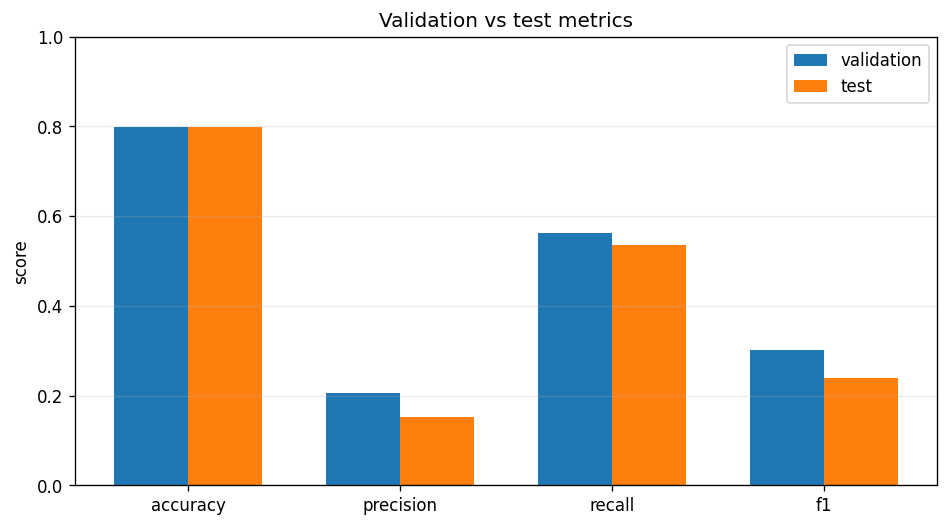

# Model Validation Report: mlp

## Summary

- **Validation run id:** 4
- **Model family:** mlp
- **Selected:** yes
- **Created at:** 2026-03-22 20:45:05
- **Artifact path:** `artifacts/models/mlp/20260322_234505.joblib`

## Metrics

| Split | Accuracy | Precision | Recall | F1 | N samples | Latency ms |
|-------|----------|-----------|--------|----|-----------|------------|
| validation | 0.7996 | 0.2061 | 0.5628 | 0.3017 | 140518 | 62.1557 |
| test | 0.7978 | 0.1533 | 0.5356 | 0.2384 | 147238 | 78.4806 |

## Chart



## Class Balance

| Split | True positives | Pred positives | Positive rate | Pred positive rate | Zero baseline accuracy |
|-------|----------------|----------------|---------------|--------------------|------------------------|
| validation | 10811 | 29521 | 0.0769 | 0.2101 | 0.9231 |
| test | 8699 | 30393 | 0.0591 | 0.2064 | 0.9409 |

## Confusion Matrix

| Split | TP | TN | FP | FN |
|-------|----|----|----|----|
| validation | 6084 | 106270 | 23437 | 4727 |
| test | 4659 | 112805 | 25734 | 4040 |

## Split

- **Train ratio:** 0.7
- **Validation ratio:** 0.15
- **Test ratio:** 0.15
- **Train dates:** 1789
- **Validation dates:** 383
- **Test dates:** 384
- **Train rows:** 514280

## Feature Space

- **Feature columns:** 13
- **Numeric features:** 6
- **Categorical features:** 7
- **Dropped columns:** OBJECT_ID

## Hyperparameters

```json
{
  "activation": "relu",
  "alpha": 0.0001,
  "batch_size": 256,
  "early_stopping": true,
  "hidden_layer_sizes": [
    128,
    64
  ],
  "learning_rate_init": 0.001,
  "max_iter": 30,
  "random_state": 42,
  "solver": "adam"
}
```
